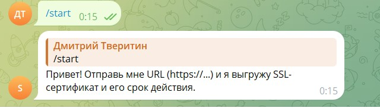
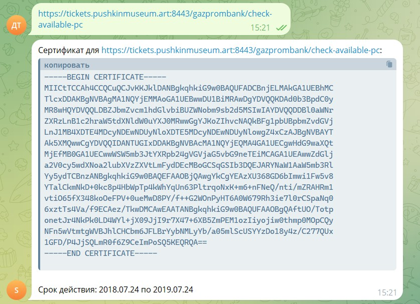

# SSL-BOT-for-telegram 🚀



## О проекте
Telegram-бот для проверки SSL-сертификатов, работающий 24/7.  
Автоматическая проверка сайтов, логирование и уведомления.  

## Технологии
- Python 3.10, asyncio
- Telegram Bot API
- CI/CD: GitHub Actions
- Raspberry Pi, systemd
- pytest, flake8, black

## Скриншоты


## Установка и запуск
```bash
git clone https://github.com/IOXNSUN/SSL-BOT-for-telegram.git
cd SSL-BOT-for-telegram
python3 -m venv venv
source venv/bin/activate
pip install -r requirements.txt
python ssl_bot.py

CI/CD

Автоматическое тестирование через pytest
Автоматический деплой на Raspberry Pi через GitHub Actions
Telegram-уведомления о статусе тестов и деплоя

Ссылки
[Telegram-бот](https://t.me/CPA_SSL_BOT)
